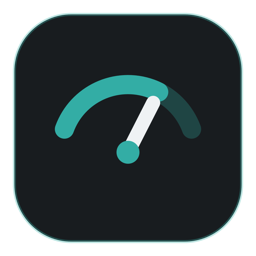
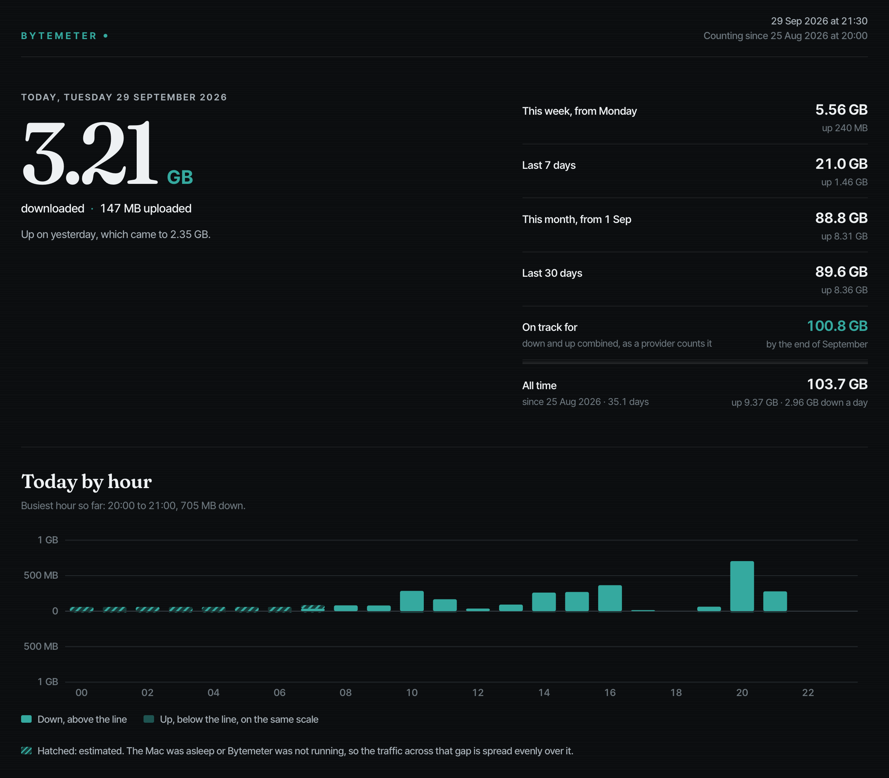
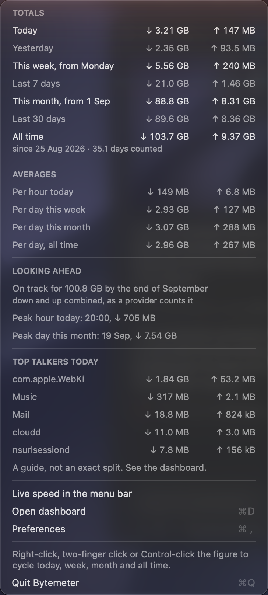
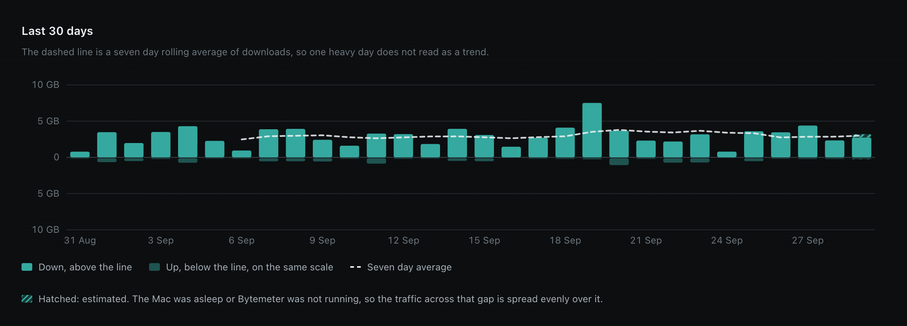
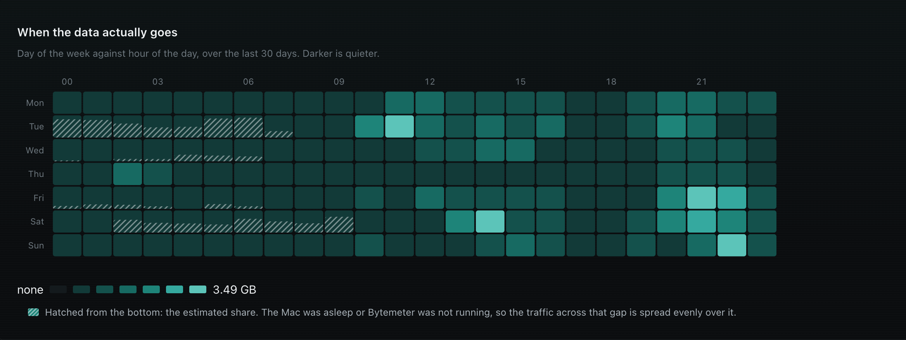

# Bytemeter

A macOS menu bar app that counts every byte your Mac sends and receives.

Bytemeter is a native Swift menu bar app for macOS 13 and later that counts every byte in and out of your Mac's physical network interfaces and reports it in detail. It shows today, this week, this month and all time in the menu bar, and opens a dashboard with an hourly chart, a 30-day trend, a day-against-hour heatmap, per-app and per-interface breakdowns and a CSV export. It makes no network requests of any kind: a tool that measures data use should not spend data, so everything stays on your machine.

It began as a way to make sense of a shared connection that could not tell one machine's traffic from another's.



The screenshots on this page use generated demo data (`Scripts/make_demo_db.py`), not real usage.

## Requirements

- macOS 13 or later.
- For building from source: the Xcode Command Line Tools (`xcode-select --install`), not full Xcode.

## Install

With [Homebrew](https://brew.sh):

```bash
brew tap adi-debug-source/bytemeter https://github.com/Adi-debug-source/bytemeter
brew install adi-debug-source/bytemeter/bytemeter
bytemeter-setup
```

The formula lives in this repository, so the first line points Homebrew at it once. The second fetches and builds Bytemeter. The third copies the app to `~/Applications` and adds the login item, because Homebrew cannot write to your home folder itself. After `brew upgrade bytemeter`, run `bytemeter-setup` again. To remove it, run `bytemeter-setup --uninstall`, then `brew uninstall bytemeter`; your usage history is kept.

Or from a clone:

```bash
git clone https://github.com/Adi-debug-source/bytemeter.git
cd bytemeter
./install.sh
```

`install.sh` builds the app with `swift build -c release`, ad-hoc signs `Bytemeter.app`, copies it to `~/Applications`, and adds a login item so it starts at login. The login item restarts the app after a crash, but if you quit it, it stays quit until the next login. It is safe to run again after `git pull` to update. The options are:

- `--uninstall`: removes the app and the login item, and keeps your data.
- `--dry-run`: says what it would do and changes nothing.
- `--bundle-only DIR`: builds the app without installing it.
- `--app PATH`: installs an app that is already built.

Bytemeter is not notarised, and it does not need to be. Both routes build it on your own Mac, so there is no downloaded app for macOS to quarantine, and it opens without a warning.

## The menu bar

The menu bar item shows one total, with monospaced digits so its width does not jitter as the figure changes.

- Left-click opens the menu.
- Right-click, a two-finger click or a Control-click cycles the figure through Today, This week, This month and All time. The choice persists across restarts.
- Live speed is a separate toggle in the menu. When it is on, the current rate appears beside the total; it never replaces it.



The menu holds:

- **Totals:** today, yesterday, this week (from Monday), the last 7 days, this month (from the 1st), the last 30 days, and all time since counting began. The four totals the menu bar can cycle through (today, this week, this month and all time) are drawn at full contrast; the rest are grey. All time shows its start date and day count beneath it, for example "since 1 Jan 2026 · 90.0 days counted".
- **Averages:** per hour today, per day this week, per day this month, and per day across all time.
- A **month-end projection** (download and upload combined, as a provider counts them), the **peak hour** and the **peak day**. Every other headline figure is download; the projection is the one that adds the two together, and the screens say so.
- **Top talkers** today, per app.
- **Open dashboard** (⌘D), **Preferences** and **Quit**.

## The dashboard

Open dashboard writes one dark, self-contained HTML page and opens it. It is regenerated each time, with hand-rolled inline SVG and native SVG tooltips: zero JavaScript, zero network requests. A CSV export sits beside it as a real file.

Seven sections, and an eighth once there are two months of data:

1. Today, by hour.
2. The last 30 days, with a rolling 7-day average.
3. A day-of-week against hour-of-day heatmap.
4. Top talkers, per app.
5. Idle against active.
6. Per interface.
7. Per network.
8. Month by month, once a second month begins.





## What it collects, and where it stays

Bytemeter reads the kernel's own interface byte counters every 5 seconds and keeps per-app totals from `nettop`. It writes minute-level rows to a local SQLite database:

```
~/Library/Application Support/Bytemeter/bytemeter.db
```

Minute rows are kept for 90 days, then collapsed to hourly, so on a typical machine the file levels off at roughly 40 MB and then grows by a few MB a year. Its log is at `~/Library/Logs/Bytemeter/bytemeter.err`.

Nothing leaves the machine. Bytemeter makes no network requests at all, not for charts, fonts or updates, and the dashboard fetches nothing when you open it.

Reading your Wi-Fi network name is off by default, and while it is off Bytemeter never touches Location Services. Switching it on in Preferences asks macOS for Location Services, because macOS treats a network name as location information. If you refuse, the feature switches itself back off and tells you where to allow it. Because each build is ad-hoc signed afresh, macOS may forget the permission after an update. Bytemeter never asks again on its own: Preferences says that network names are not being recorded, and offers to ask macOS again.

## How accurate it is

Bytemeter aims to be exact about what it can measure, and plain about what it cannot.

- **The count is exact.** Bytemeter records exactly what the kernel's own interface counters say, to the byte. On the Mac it was developed on, the sum of every saved minute since the last reboot matched the kernel counter's own movement over the same period to 0 bytes in and 0 bytes out, checked repeatedly over several days, across two reinstalls and a database migration.
- **Where it can miss bytes, and by how much.** The gaps are small and bounded:
  1. the last few seconds before a shutdown or restart, at most one 5-second reading, because the counter starts again from zero at boot;
  2. an interface reset that is not a reboot, up to one 5-second reading, because there is no start time to measure from;
  3. traffic between quitting Bytemeter and restarting the Mac before you open it again. Quitting on its own loses nothing, because the next launch picks up everything since the last reading, and a crash loses nothing either, because it restarts within seconds and does the same;
  4. traffic from before Bytemeter was first installed, which is not counted by design.
- **Timing.** Figures are kept per minute. A reading that straddles a minute boundary lands in the later minute, so a minute can be out by at most 5 seconds' worth of traffic, and hourly and daily figures the same way, only at their edges. Sleep periods are the exception: the bytes are exact, but their timing is spread evenly and marked as estimated. And if the Mac's clock is ever set ahead by hand and then corrected, new traffic is filed under the later time until the clock catches up; nothing is lost or counted twice.
- **Rounding on screen.** The menu and the dashboard round for readability: under 10 GB they show two decimals (3.21 GB, so plus or minus 5 MB), and from 10 GB up one decimal (plus or minus 50 MB). The database and the CSV export keep exact byte counts.
- **Per-app figures are a guide, not an exact split.** They come from `nettop` and only ever under-report. On the development Mac about 80% of interface bytes were attributed to an app; the rest belongs to processes that exited between samples, and to traffic `nettop` does not attribute.
- **Against a provider's or router's figure, expect small differences, not a match to the byte.** A provider or router counts at its own point in the network and in its own way, and a router counts every device on the connection, while Bytemeter counts only what this Mac's own interfaces moved.
- **Units are decimal** (1 GB = 1,000,000,000 bytes), as providers count; see Counting below.

## What it does not claim

Bytemeter is careful about saying what it knows and what it does not.

- **Per-app figures under-report.** They come from `nettop`, and a process that exits between samples takes its last few seconds with it, so a per-app total is a good guide rather than an exact split. The interface counters are the source of truth, and the two will not reconcile to the byte.
- **Sleep is counted, but its timing is estimated.** The traffic across a sleep is real, so it is counted, but its timing is not observed. Bytemeter spreads it evenly across the gap and marks those minutes as estimated. The dashboard draws them hatched, with a one-line key, and its tooltips say how much of a figure is estimated. Totals never change because of this.
- **"All time" means since Bytemeter started counting**, not since the Mac was new. Traffic already on the counter when Bytemeter first runs has no timestamps, so it is left out rather than folded in to flatter the figure.
- **Reboots are told from interface resets.** Bytemeter uses the kernel's boot session id, which changes only at a reboot. After a genuine reboot, everything on the counter since boot is counted. After an interface reset without a reboot, the baseline moves and nothing is booked, because there is no start time to measure from.
- **Weeks start on Monday, dates read day first, and the clock is yours.** Bytemeter uses ISO 8601 weeks and writes dates day first whatever your Mac's region is set to, by choice, so a figure means the same thing on every machine. Daily, hourly and heatmap figures track local time correctly across clock changes, including half-hour time zones.

## How it works, and why

### Counting

1. **The interface counters are read every 5 seconds**, each reading diffed against the last, and the difference added to a one-minute bucket. Everything above a minute (hour, day, week, month, the averages, the projection) is computed at query time from those buckets, so no two figures on screen can ever disagree.
2. **The last raw reading is saved after every sample.** On launch the live counter is compared against the stored value, so traffic that happened while the app was not running is picked up rather than lost.
3. **A reading lower than the last one is a reset, not negative traffic.** The baseline moves and no phantom multi-gigabyte spike is booked. The kernel's boot session id, which changes only at a reboot, tells a genuine reboot (after which the bytes since boot are counted) from an interface reset (after which nothing is booked, because there is no start time to measure from).
4. **Only physical interfaces are counted**, meaning `en` followed by a number. VPN tunnels, bridges, AirDrop and loopback are all excluded, because a VPN's tunnel carries the very same bytes as the Wi-Fi interface underneath it; counting both would double every figure the moment a VPN came on.
5. **Units are decimal:** 1 GB is 1,000,000,000 bytes, the way internet providers and routers count, so the figures are in the same units as your bill.

### Where the counters come from

Not `getifaddrs`. On macOS `getifaddrs` returns a `struct if_data` whose `ifi_ibytes` is a `u_int32_t`, so it wraps every 4.29 GB, and the route-socket path `NET_RT_IFLIST2` returns the same truncated value. Either would lose roughly 4 GB at a time, silently, and every wrap would look just like a reboot.

Bytemeter reads `net.link.generic.ifdata.<index>.general` through `sysctl` instead, which fills a `struct ifmibdata` whose `ifmd_data` really is an `if_data64`. Its value matches `netstat -ib` exactly. The 32-bit counters are kept as a wrap-aware fallback for the rare case where the MIB is unavailable, and the app records which source is live.

### How it is put together

Three targets, and the split is deliberate:

1. **BytemeterCore** is the engine: reading the interface counters, working out deltas, spotting resets, bucketing by minute, the SQLite schema and every aggregation query. It imports nothing macOS-only, so an iOS version could use it untouched.
2. **Bytemeter** is the macOS app: the menu bar item, `nettop` sampling, the dashboard generator, preferences, and sleep and wake handling.
3. **BytemeterSelfTest** is a plain executable, not an XCTest target, for the reason in the next section.

## Build from source and testing

```bash
swift build -c release                     # build
swift run -c release BytemeterSelfTest     # run the self-test, 469 checks
```

The self-test is a plain executable rather than an XCTest target because XCTest cannot be resolved with the Command Line Tools alone; `swift test` needs a full Xcode install, and this project does not assume one. CI runs the self-test on every push, builds the app bundle from a clean checkout, and verifies its signature.

### Working with a database directly

After `swift build -c release`, the binary is at `.build/release/Bytemeter`. Two commands work on a database without running the menu bar app, and a script makes a synthetic one:

```bash
.build/release/Bytemeter --dashboard <folder> [--as-of <time>]   # build the dashboard as it was at that moment
.build/release/Bytemeter --demo <folder> [--as-of <time>]        # run the real menu, read-only, against a demo database
python3 Scripts/make_demo_db.py <folder> [--now <time>]          # make a synthetic month
```

The screenshots in this README are made this way, from invented data, so nothing real is shown. The exact commands that reproduce them are in [MAINTENANCE.md](MAINTENANCE.md#screenshots).

## Licence

MIT, see [LICENSE](LICENSE). Copyright (c) 2026 Aditya Kumar.
